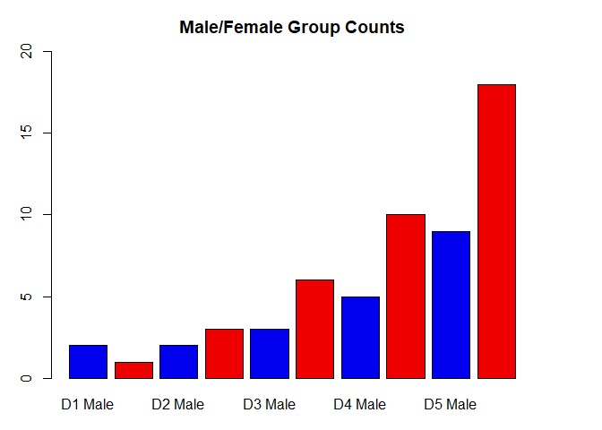

Class5: Data exploration and visualization in R
================
Kane Wu
2019-10-31

``` r
x <- rnorm(1000)

# some summary stats
mean(x)
```

    ## [1] -0.0110716

``` r
sd(x)
```

    ## [1] 0.9755063

``` r
summary(x)
```

    ##     Min.  1st Qu.   Median     Mean  3rd Qu.     Max. 
    ## -3.37037 -0.65547 -0.02473 -0.01107  0.64243  2.82686

``` r
#growth(slope)

# Section 2 Scatterplots
# let's read our input file first

read.table("bimm143_05_rstats/weight_chart.txt")
```

    ##     V1     V2
    ## 1  Age Weight
    ## 2    0    3.6
    ## 3    1    4.4
    ## 4    2    5.2
    ## 5    3      6
    ## 6    4    6.6
    ## 7    5    7.2
    ## 8    6    7.8
    ## 9    7    8.4
    ## 10   8    8.8
    ## 11   9    9.2

``` r
baby <- read.table("bimm143_05_rstats/weight_chart.txt",
                   header = TRUE)
#plot(read.table("bimm143_05_rstats/weight_chart.txt")
#plot(baby)     
plot(baby$Age, baby$Weight, type = "o", cex=1, pch=15, lwd=2, ylim = c(2,10), xlab="baby age (months)", ylab="baby weight(kg)", main = "Baby Weight with Age")
```

<!-- -->

``` r
feat <- read.table("bimm143_05_rstats/feature_counts.txt",
                   sep = "\t", header = TRUE)
mouse <- read.delim("bimm143_05_rstats/feature_counts.txt")
par(mar=c(3,11,2,8))
barplot(mouse$Count,names.arg= mouse$Feature, horiz = TRUE, las=1, beside=TRUE, main = "Number of Feature in the mouse GRCm38 Genome", xlim= c(0,80000), ylab = "", las=1)     
```

<!-- -->

``` r
#male/female count
gender <- read.delim("bimm143_05_rstats/male_female_counts.txt", header = TRUE)
gender
```

    ##       Sample Count
    ## 1    D1 Male     2
    ## 2  D1 Female     1
    ## 3    D2 Male     2
    ## 4  D2 Female     3
    ## 5    D3 Male     3
    ## 6  D3 Female     6
    ## 7    D4 Male     5
    ## 8  D4 Female    10
    ## 9    D5 Male     9
    ## 10 D5 Female    18

``` r
par(mar=c(3,3,3,4))
barplot(gender$Count,names.arg = gender$Sample, beside = TRUE, col = c("blue2","red2"), ylab = "Counts", main = "Male/Female Group Counts", ylim = c(0,20))
```

<!-- -->

``` r
#up/down expression
genes <- read.delim("bimm143_05_rstats/up_down_expression.txt")
table(genes$State)
```

    ## 
    ##       down unchanging         up 
    ##         72       4997        127

``` r
par(mar=c(4,4,4,4))
palette(c("blue", "grey", "red"))
plot.default(genes$Condition1,genes$Condition2, col=genes$State, xlab = "Expression Condition1", ylab = "Expression Condition2", main = "Up vs. Down Plot")
```

<!-- -->

``` r
palette()
```

    ## [1] "blue" "gray" "red"

``` r
levels(genes$State)
```

    ## [1] "down"       "unchanging" "up"

``` r
#Expression Methylation
methyl <- read.delim("bimm143_05_rstats/expression_methylation.txt")
dcols <- densCols(methyl$gene.meth,methyl$expression)
plot.default(methyl$gene.meth,methyl$expression, col= dcols, pch= 20)
```

<!-- -->

``` r
inds <- methyl$expression > 0
plot.default(methyl$gene.meth[inds], methyl$expression[inds], col=dcols, pch=20)             
```

<!-- -->

``` r
dcols.custom <- densCols(methyl$gene.meth[inds],methyl$expression[inds],
                         colramp = colorRampPalette(c("blue2", 
                                                      "green2",
                                                      "red2",
                                                      "yellow")))
plot(methyl$gene.meth[inds], methyl$expression[inds], col=dcols.custom, pch = 20)
```

<!-- -->
